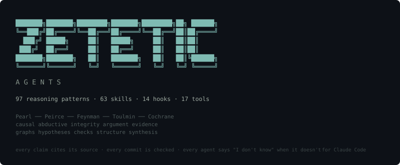

<p align="center">
  
</p>

<p align="center">
  <a href="LICENSE"></a>
  
  
  
  
</p>

---

## What you type → what happens

```
/genius route "p99 latency exceeds the sum of profiled components"
→ Routes to Curie (residual-with-a-carrier) + Knuth (profile-before-optimizing)

/genius invoke fermi "Can our database handle 10x users?"
→ Decomposes into bracketable factors, produces a two-sided bound

/deep-research "transformer attention alternatives 2024-2026"
→ Plans search → parallel researchers → synthesizes → verifies citations → writes cited brief + provenance sidecar

/systematic-review "effect of code review on defect rate"
→ PICO protocol → exhaustive search → screen → extract effect sizes → heterogeneity test → GRADE evidence → forest plot

/incident-investigation
→ Forensic timeline (Ginzburg) → three-timescale decomposition (Braudel) → common vs special cause (Deming) → structural root cause (Peirce) → remediation (Hamilton)

/paper-vs-code-audit arxiv:2401.12345 ./src/
→ Extracts every claim → finds corresponding code → flags mismatches → produces traceability matrix

/autoresearch-loop "optimize beam search for abstention"
→ Hypothesis → implement → commit → benchmark → keep/revert → iterate until diminishing returns
```

---

## Install

### Plugin install (recommended)

```bash
# Install from marketplace
claude plugin marketplace add cdeust/zetetic-team-subagents
claude plugin install zetetic-team-subagents
```

The plugin ships a `setup.sh` installer (Cortex-style) that copies agents, skills, commands, hooks, tools, and rules into `~/.claude/` and merges lifecycle hooks into `plugin.json`. It runs automatically via the plugin's `postInstall` hook. You can also invoke it directly:

```bash
bash scripts/setup.sh install      # install or re-install
bash scripts/setup.sh update       # re-apply agent models, pull new assets, prune orphans
bash scripts/setup.sh configure    # create ~/.claude/zetetic-agent-models.json with sensible defaults
bash scripts/setup.sh uninstall    # remove tracked files; keeps user-modified copies
bash scripts/setup.sh --dry-run    # preview any of the above
```

### Manual install (no plugin system)

```bash
git clone https://github.com/cdeust/zetetic-team-subagents.git
cd zetetic-team-subagents
bash scripts/setup.sh install
```

Skills-only (no agents):
```bash
cp -r zetetic-team-subagents/skills/ ~/.claude/skills/
```

---

## Configuration & customization

Three config files are yours to keep — plugin updates never overwrite them.

### 1. `~/.claude/zetetic-agent-models.json` — per-agent **model + effort** overrides

Controls which model each agent uses (opus / sonnet / haiku) **and** its reasoning-token budget (effort: low / medium / high / max). Run `setup.sh configure` to create it with calibrated defaults.

**Two formats, both supported in the same file:**

```json
{
  "patterns": [
    { "glob": "genius/*", "model": "sonnet" }
  ],
  "agents": {
    "refactorer":       { "model": "haiku",  "effort": "low"    },
    "engineer":         { "model": "sonnet", "effort": "medium" },
    "architect":        { "model": "opus",   "effort": "high"   },
    "code-reviewer":    "sonnet",
    "test-engineer":    { "effort": "medium" }
  }
}
```

- **String value** (`"sonnet"`): model shorthand. Effort kept from frontmatter.
- **Object value** (`{ model, effort }`): set either or both. Omit a field to keep the frontmatter default.

Precedence: per-call `model` / `effort` parameter > this file > agent frontmatter default.

**Calibrated defaults shipped by `setup.sh configure`:**

| Agents | Model | Effort | Why |
|---|---|---|---|
| `refactorer`, `latex-engineer` | haiku | low | Mechanical work (Fowler catalog / template) |
| `engineer`, `code-reviewer`, `test-engineer`, `frontend-engineer`, `dba`, `devops-engineer`, `data-scientist`, `experiment-runner`, `mlops`, `ux-designer`, `professor` | sonnet | medium | Procedural with decision points |
| `orchestrator` | opus | medium | Routing, not deep reasoning |
| `architect`, `security-auditor`, `research-scientist`, `paper-writer`, `reviewer-academic` | opus | high | Deep structural or evidence reasoning |
| 97 genius agents (default) | sonnet | medium or high (from frontmatter) | Procedural patterns at medium; deep-reasoning patterns (Feynman, Dijkstra, Lamport, Gödel, Einstein, etc.) at high |

Estimated token savings vs. all-opus default: **~2.5–3×** on typical sessions.

Re-run `setup.sh update` to apply changes to installed agents.

### 1a. Adaptive reasoning depth (stakes-driven, automatic)

On top of the static config above, five team agents (`engineer`, `architect`, `code-reviewer`, `security-auditor`, `research-scientist`) adjust reasoning depth dynamically based on their stakes classification:

- **Low-stakes** change → reason one level below baseline effort (skip exploratory alternatives)
- **Medium-stakes** → baseline effort
- **High-stakes** → reason one level above baseline (enumerate alternatives, full verification loop)

The classification is objective (see `rules/coding-standards.md` §10 and each agent's stakes criteria). No config needed — it's built into the agent's Moves.

### 2. `<repo-root>/.zetetic.conf` — per-project checker config

Controls `tools/zetetic-checker.sh` behavior for a specific project. Committed, auditable.

```bash
# .zetetic.conf — project-local zetetic checker config
ZETETIC_PROFILE=standard           # strict | standard | permissive
ZETETIC_CHECK_DATA_FORMATS=false   # true to scan .json/.yaml/.toml/.sql/.csv (default: skipped)
```

**Profile meanings:**
- `strict` — UNSOURCED, MAGIC_NUMBER, and TODO_NO_REF all block commits
- `standard` (default) — UNSOURCED blocks; MAGIC_NUMBER / TODO_NO_REF warn only
- `permissive` — everything informational; never blocks (useful during transition — see next section)

**What you cannot do in `.zetetic.conf`:** disable or remove built-in rules. Directives like `DISABLE_UNSOURCED=true`, `SKIP_RULE`, `EXCLUDE_RULE` cause the checker to refuse to load the config. You can override file/path exclusions and the profile; you cannot silence the checks themselves.

### 3. `<repo-root>/.zetetic-check.sh` — project-local extensions

Optional Bash script sourced by `zetetic-checker.sh` if present. Can add project-specific checks that increment `ERRORS` or `WARNINGS`. Cannot disable built-in checks (same guarantee as `.zetetic.conf`).

---

## Adopting this plugin in an existing (non-compliant) project

The plugin's defaults assume a greenfield project. For an existing codebase with historical constants, TODOs without trackers, and "always" / "never" comments, running `--staged` on every commit would be painful. Here's the migration path.

### Step 1 — Scan once to measure the backlog

```bash
bash tools/zetetic-checker.sh --full
```

This scans every tracked file. Count the findings by type:
- **UNSOURCED** (errors) — absolute claims without citations; usually small and worth fixing
- **MAGIC_NUMBER** (warnings) — tuning constants without `# source:`; usually large
- **TODO_NO_REF** (warnings) — orphan TODOs; often fixable by linking to your issue tracker

### Step 2 — Set `ZETETIC_PROFILE=permissive` for the transition

Create `.zetetic.conf` at the repo root:

```bash
ZETETIC_PROFILE=permissive
```

In permissive mode, the checker reports findings but never blocks. Commits go through. This lets you keep the instrument visible while paying down the backlog at your own pace.

### Step 3 — Burn down existing violations

The plugin ships a `refactorer` team agent and a `code-reviewer` team agent. Use them incrementally:

```
# For magic numbers:
Ask the engineer or refactorer to add // source: annotations to constants
they can verify from docs, benchmarks, or the standard library. For the rest,
consider extracting to a named constant with a derivation comment.

# For orphan TODOs:
# TODO: refactor later                    → bad
# TODO(#264): extract shared validator    → good
```

You do not have to fix everything. Some constants are truly infrastructure (HTTP status codes, array sizes, port numbers) and the default regex already skips them.

### Step 4 — Graduate to `ZETETIC_PROFILE=standard`

When the `--full` scan returns 0 UNSOURCED errors (or a manageable number you can triage per PR), switch:

```bash
ZETETIC_PROFILE=standard
```

Now UNSOURCED blocks commits, but MAGIC_NUMBER and TODO_NO_REF still only warn. The hooks will catch any regression without overwhelming the team.

### Step 5 — Lock in `strict` on the components that matter most

For the high-stakes parts of your system (algorithms from papers, financial logic, crypto, ML hyperparameters, the components listed in rules/coding-standards.md §10 "High stakes"), you can enforce strict locally via a directory-scoped `.zetetic.conf`, a pre-push hook that runs `ZETETIC_PROFILE=strict` on those paths, or an ADR that formalizes the stricter threshold.

### Customizing which team agents proactively fire

Eight agents auto-delegate by default (refactorer, code-reviewer, test-engineer, security-auditor, architect, Feynman, Curie, Dijkstra). If you want them invoked less aggressively on an existing project that is not yet compliant, you can:

1. Edit the installed agent copy in `~/.claude/agents/` to remove the `Proactively` lead-in and scenario examples (survives plugin updates because setup.sh detects user-modified files and backs them up before overwriting).
2. Or set specific agents to `model: haiku` in `~/.claude/zetetic-agent-models.json` for cheaper evaluation during the transition period.

---

## 97 Genius Agents — Reasoning Patterns, Not Personas

Not "pretend to be Einstein." Actual methods — each with 5 canonical moves, primary-source citations, blind spots, refusal conditions, and hand-off protocols. Routed by **problem shape**, not by field.

| Domain | Agents | Example trigger |
|---|---|---|
| **Measurement & Signal** | Curie, Ekman, Wu | "The measurement exceeds what known parts predict" |
| **Estimation & Bounding** | Fermi, Erlang, Laplace | "We don't have data — can we bracket it?" |
| **Causal & Abductive** | Pearl, Peirce, Snow/Hill | "Does X cause Y, or is it confounded?" |
| **Systems & Leverage** | Meadows, Beer, Kauffman, Deming, Maxwell | "Where should we intervene for maximum effect?" |
| **Formal & Correctness** | Dijkstra, Lamport, Panini, Godel, Turing | "Can we prove this correct?" |
| **Design & Pattern** | Alexander, Altshuller, Liskov, Kay | "The trade-off seems inescapable" |
| **Failure & Resilience** | Hamilton, Taleb, Carnot, Boyd | "What happens when everything goes wrong?" |
| **Reverse Engineering** | Rejewski, Champollion, Ventris | "The system is a black box — reconstruct it" |
| **Decision & Bias** | Kahneman, Schon, Roger Fisher, Simon | "Is this decision driven by bias?" |
| **Ethics & Justice** | Rawls, Arendt, Le Guin, Ostrom | "Who benefits and who bears the cost?" |
| **Research Method** | Toulmin, Cochrane, Strauss, Geertz, Gadamer | "How do we build a rigorous argument from evidence?" |
| **Scale & Dynamics** | Mandelbrot, Thompson, Poincare, Schelling | "What breaks when this grows 10x?" |
| **Language & Meaning** | Wittgenstein, Eco, Foucault, Midgley, Aristotle | "We're all using the same word to mean different things" |
| **History & Civilization** | Braudel, Ibn Khaldun, Ginzburg, Borges | "At which timescale does the cause live?" |
| **Biology & Evolution** | Darwin, Margulis, Fleming, Noether | "Could this be cooperation, not competition?" |
| **Discovery & Invention** | Archimedes, Polya, Ramanujan, Euler, Lem | "I'm stuck — what heuristic should I try?" |
| **Narrative & Pedagogy** | Bruner, Propp, Vygotsky, Zhuangzi | "Is the metric we're optimizing the right one?" |
| **Legal & Comparative** | Hart, Mill, Coase, Bateson | "The rule doesn't clearly determine the outcome" |
| **Ancient & Non-Western** | Al-Khwarizmi, Ibn al-Haytham, Nagarjuna, Panini | "Reduce this to canonical form" |

> **Full shape-to-agent routing table:** [`agents/genius/INDEX.md`](agents/genius/INDEX.md) — 400+ problem shapes with triggers, pairings, and composition chains.

---

## 63 Skills — Research & Engineering Workflows

Every skill has **four zetetic gates** (logical, critical, rational, essential) that must pass before output is delivered.

| Category | Skills |
|---|---|
| **Research** (16) | `/deep-research` `/systematic-review` `/literature-review` `/paper-vs-code-audit` `/autoresearch-loop` `/lab-notebook` `/source-comparison-matrix` `/research-watch` `/replication-assessment` `/research-question-formulation` `/mixed-methods-design` `/qualitative-analysis` `/write-paper` `/pre-submit-review` `/design-experiment` `/explain` |
| **Engineering** (11) | `/review` `/implement` `/debug` `/optimize` `/secure` `/refactor` `/test` `/deploy` `/migrate-db` `/incident-investigation` `/security-audit` |
| **Architecture** (9) | `/decompose` `/adr` `/spec` `/contract` `/evaluate-tool` `/architecture-review` `/system-design-document` `/api-design-review` `/database-design-review` |
| **Compose** (12) | `/performance-investigation` `/anomaly-to-explanation` `/conjecture-to-code` `/failure-resilient-design` `/product-quality-audit` `/new-tool-design` `/statistical-intervention` `/migrate-system` `/sunset-decision` `/translation-across-systems` `/argument-construction` `/onboarding-curriculum` |
| **Zetetic** (7) | `/verify-claim` `/difficulty-book` `/cargo-cult-check` `/seek-disconfirmation` `/citation-verifier` `/provenance-tracking` `/ethical-review` |

---

## Compose Chains — Multi-Agent Pipelines

The most powerful skills chain genius agents in sequence:

```
/performance-investigation     fermi → curie → knuth
  Bracket expected → measure actual → profile hot 3%

/incident-investigation        ginzburg → braudel → deming → peirce → hamilton
  Forensic trace → three timescales → common/special cause → root cause → remediation

/anomaly-to-explanation        mcclintock → curie → shannon
  Notice → isolate carrier → formalize

/deep-research                 peirce → cochrane → feynman → toulmin
  Hypothesize → synthesize evidence → integrity check → structure argument

/failure-resilient-design      hamilton → lamport → engineer
  Design degradation → specify → build

/autoresearch-loop             peirce → fisher → curie → laplace → schon
  Hypothesize → design experiment → measure → compare → detect diminishing returns
```

---

## 18 Tools

| Tool | What it does |
|---|---|
| `agent-definition-auditor` | 16 structural checks across all 116 agent files (frontmatter, tools, Moves, citations, shapes, collaboration hints) — exits non-zero on any blocker |
| `genius-invoker` | Lightweight agent invocation, routing, composition |
| `provenance-manager` | Track sources consulted/accepted/rejected per file |
| `lab-notebook-manager` | Structured research notebook with tags and timeline |
| `research-session-manager` | Start/resume/close research sessions with hypothesis tracking |
| `docker-runner` | Isolated research containers with workspace mount |
| `mlx-compute` | Apple Silicon ML via MLX — benchmark, convert, run |
| `live-preview` | Browser preview for .md/.tex/.html with auto-recompile |
| `shape-router` | Route problems to genius agents by shape |
| `zetetic-checker` | Scan for magic numbers, unsourced claims, orphaned TODOs |
| `difficulty-book-manager` | Track contradictions and open problems |
| `agent-catalog` | List, search, describe agents |
| `worktree-manager` | Manage parallel agent worktrees |
| `balance-auditor` | Conservation check: inputs = outputs |
| `profile-runner` | Auto-detect profiler (Python/Node/Go/Rust) |
| `skill-runner` | Resolve and execute skills |
| `session-store` | Save/load session context |
| `hook-runner` | Execute hooks with timeout/fallback |

---

## 14 Hooks — Automated Epistemic Enforcement

**The part no other agent system has.** The zetetic standard is not a prompt suggestion — it is an automated gate.

| Hook | What it enforces |
|---|---|
| `pre-commit-zetetic` | Blocks commits with invented constants or unsourced claims |
| `pre-push-review` | Blocks pushes with zetetic violations |
| `pre-push-provenance` | Verifies provenance sidecars exist for research files |
| `pre-tool-claim-gate` | Catches unsourced constants at edit time |
| `pre-edit-layer-check` | Warns on Clean Architecture layer violations |
| `post-research-provenance` | Auto-logs sources during research to .provenance.md |
| `post-commit-difficulty` | Reminds to update difficulty book |
| `post-commit-lab-notebook` | Prompts notebook entry during research sessions |
| `post-edit-balance` | Reminds to verify data conservation |
| `post-tool-error-routing` | Suggests diagnostic genius agent on errors |
| `session-start` | Loads repo state, difficulty books, research context |
| `session-start-research` | Loads active research question, hypotheses, notebook |
| `session-end` | Saves decisions, open questions to memory |
| `notification-handler` | Logs subagent completion |

---

## The Zetetic Standard

Every agent, skill, and hook inherits this. It is not optional.

| Pillar | Question |
|---|---|
| **Logical** | *Is it consistent?* |
| **Critical** | *Is it true?* |
| **Rational** | *Is it useful?* |
| **Essential** | *Is it necessary?* |

**The rules:**
1. No source → say "I don't know" and stop
2. Single source = hypothesis. Cross-reference required
3. Read the actual paper, not the blog post
4. No invented constants. Cite the equation or the data
5. Benchmark every change. No regressions accepted
6. "I don't know" preserves trust. Confident wrong answers destroy it
7. Actively seek disconfirming evidence

---

## How It Works

```
You describe a problem
  ↓
Shape router matches problem shapes in INDEX.md (400+ shapes)
  ↓
Routes to 1-3 genius agents with the right reasoning pattern
  ↓
Each agent applies its canonical moves with primary-source methodology
  ↓
Zetetic gates verify: sourced? tested? proportional? necessary?
  ↓
Hooks enforce: no unsourced claims committed, no magic numbers pushed
  ↓
Output: cited, verified, with provenance sidecar and difficulty book
```

### Agent file shape (since v2.13.0)

Each agent ships as a single markdown file. Frontmatter is kept slim so cumulative description tokens across all 116 agents stay well under Claude Code's startup cap (currently ~12.6k tokens, was 28k in v2.12.0). Rich routing detail lives in a `<routing>` body section, loaded only when the agent is invoked — no methodology depth lost.

```yaml
---
name: dijkstra
description: "Proactively enforce correctness discipline when..."   # 1 sentence — the routing-discriminating signal
when_to_use: "When a program's correctness cannot be established..." # 1 clause — the trigger
model: opus
effort: high
shapes: [proof-and-program-together, locality-of-reasoning, ...]
tools: [Read, Edit, Write, Bash, Glob, Grep, WebFetch, WebSearch]
---

<identity>...</identity>

<routing>
**When to use this agent (full guidance — pairings, triggers, examples,
distinct-from-X clauses; loaded only when the agent is invoked):**
[every word from the original verbose `when_to_use`, preserved here]
</routing>

<revolution>...</revolution>           <!-- genius template -->
<domain-context>...</domain-context>   <!-- team template -->

<codebase-intelligence>
[Optional MCP server `ai-architect` tool table + workflow; graceful
 degradation when the server is absent — see "Codebase Intelligence MCP"
 below.]
</codebase-intelligence>

<canonical-moves>...</canonical-moves>
<refusal-conditions>...</refusal-conditions>
<blind-spots>...</blind-spots>
```

**Why this shape?** The orchestrator only needs the frontmatter to route correctly (a sentence is enough). The invoked agent reads its full body. This separates *routing cost* (paid every session) from *methodology cost* (paid only when used), aligning with Claude Code's design while preserving every word of the canonical moves and procedure depth.

---

## What Makes This Different

Most AI agent systems ship role prompts — "you are a senior engineer" — and hope for the best. The agent sounds confident. It invents constants, cites papers it hasn't read, and ships code with conviction inversely proportional to its correctness.

**Zetetic Agents take a different position:** an AI that cannot say "I don't know" is more dangerous than one that cannot say anything at all.

| Capability | What it means |
|---|---|
| **97 reasoning patterns** | Not personas. Actual methods from primary sources — each with canonical moves, blind spots, refusal conditions |
| **Automated epistemic enforcement** | Hooks block commits with invented constants, pushes with unsourced claims. The standard is not voluntary |
| **Every domain of human inquiry** | Engineering, mathematics, physics, biology, medicine, philosophy, law, economics, social science, humanities |
| **Cochrane-style evidence synthesis** | Systematic review with GRADE, heterogeneity testing, publication bias detection |
| **Toulmin argument structure** | Claim-evidence-warrant-backing-qualifier-rebuttal. Every paper is an argument; structure it properly |
| **Full provenance tracking** | Automated .provenance.md sidecars tracking every source consulted, accepted, or rejected |
| **Local ML compute** | MLX on Apple Silicon — benchmark, convert, train without cloud costs |
| **Paper production pipeline** | Paper-writer + LaTeX-engineer + live-preview with citation verification |
| **Clinical diagnostic reasoning** | Differential diagnosis, likelihood ratios, treatment thresholds — not just for medicine |
| **Ethical reasoning framework** | Veil of ignorance, thoughtlessness audit, irreducible trade-off naming |

---

## Optional: Codebase Intelligence MCP

Seven team agents (engineer, architect, code-reviewer, refactorer, security-auditor, test-engineer, devops-engineer) can call **23 graph-level codebase tools** when the [`ai-automatised-pipeline`](https://github.com/cdeust/ai-automatised-pipeline) MCP server is attached. The agents detect MCP availability and gracefully fall back to `Glob`/`Grep`/`Read` when it's missing — no breakage if you don't have it.

**What you get when it's connected:**

| Capability | MCP tool | Replaces |
|---|---|---|
| Symbol resolution by qualified name | `mcp__ai-architect__get_symbol` | Hand-grepping for function names (which silently picks wrong target on collisions) |
| Blast-radius / impact analysis | `mcp__ai-architect__get_impact` | Hand-estimated "what does this break?" |
| Hybrid search (BM25 + sparse TF-IDF + RRF) | `mcp__ai-architect__search_codebase` | `grep -r` |
| Process / execution-flow tracing | `mcp__ai-architect__get_processes` | Hand-following call chains |
| Semantic-diff regression detection | `mcp__ai-architect__detect_changes` | Trusting that the line-diff captures behaviour |
| S1–S5 security gates | `mcp__ai-architect__check_security_gates` | Ad-hoc taint-analysis grep |
| Functional community detection (Leiden) | `mcp__ai-architect__cluster_graph` | Eyeballing module boundaries |
| Property-graph queries | `mcp__ai-architect__query_graph` | Chained grep pipelines |

**Connect it (project-level):** add to your project's `.mcp.json`:

```json
{
  "mcpServers": {
    "ai-architect": {
      "command": "cargo",
      "args": [
        "run", "--quiet", "--release",
        "--manifest-path",
        "/path/to/ai-automatised-pipeline/Cargo.toml"
      ]
    }
  }
}
```

Each updated agent now contains a `<codebase-intelligence>` section listing the relevant MCP tools and the precise condition for invoking each. Agents prefer graph queries over `Grep`/`Read` when the MCP layer is available.

---

## Companion projects

| Project | Role |
|---|---|
| [Cortex](https://github.com/cdeust/Cortex) | Persistent memory — consolidates and reconsolidates across sessions; pre-loads cognitive profile at session start |
| [ai-automatised-pipeline](https://github.com/cdeust/ai-automatised-pipeline) | Codebase intelligence MCP server — indexes code into a property graph; agents read this before reasoning |
| [prd-spec-generator](https://github.com/cdeust/prd-spec-generator) | TypeScript PRD generator that consumes graph intelligence |

---

## License

MIT — see [LICENSE](LICENSE).

---

<p align="center"><sub>Built by <a href="https://github.com/cdeust">cdeust</a>. Every agent verified by structural audit. Every claim cites its source.</sub></p>
